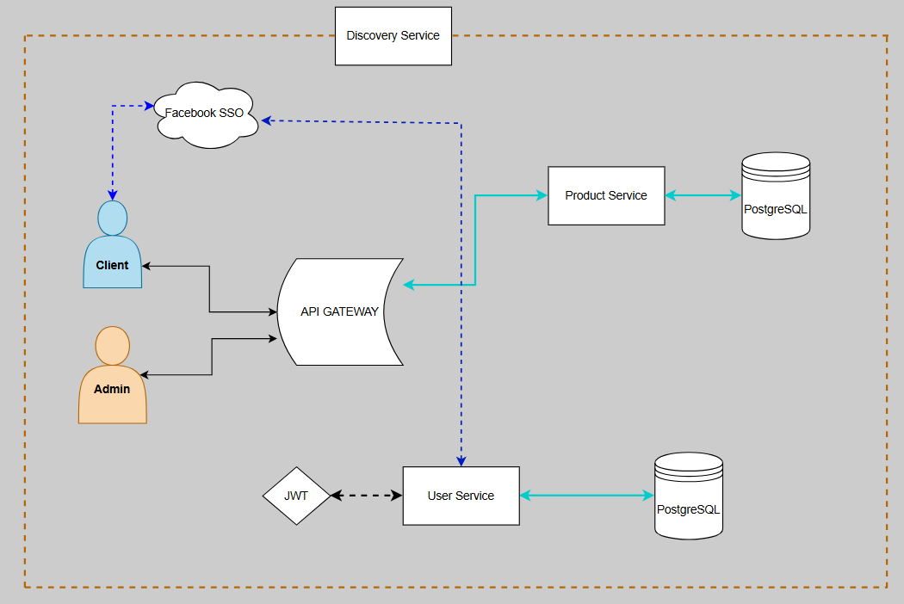

# e-commerce
A backend system for an online shopping application built with **Microservices Architecture** using Spring Boot and Spring Cloud.

## Document Organization
- [SYSTEM DESIGN DOCUMENT](#system-design-document)
  - [1. INTRODUCTION](#1-introduction)
    - [1.1 Purpose and Scope](#11-purpose-and-scope)
  - [2. SYSTEM ARCHITECTURE](#2-system-architecture)
    - [2.1 High-level Design](#21-high-level-design)
    - [2.2 Database Design](#22-database-design)
    - [2.3 Folder Structure](#23-folder-structure)
    - [2.4 Libraries](#24-libraries)
    - [2.5 Services Details](#25-services-details)
    - [2.6 Development](#26-development)
  - [3. How to Run](#3-how-to-run)
  - [4. References](#4-references)

---

## System Design Document

### Overview
The System Design Document describes the system requirements, operating environment, system and subsystem architecture, database design, API design, security mechanisms, and inter-service communication patterns.

---

### 1. INTRODUCTION

#### 1.1 Purpose and Scope
An e-commerce backend platform built as an MVP with a microservices architecture targeting the following core functionalities:

1. Customers can view all products and filter, sort, and search by criteria such as name, price, brand, and category.
2. Admins manage products, categories, brands, product status, variants, attributes, and images via a back-office API.
3. Products support multiple variants (SKUs), key-value attributes, and multiple images with thumbnail support.
4. Customers can log in via **Facebook SSO** (OAuth2) — no manual registration required.
5. Authentication is **stateless JWT**, stored in `httpOnly` Cookie for browsers and `Authorization: Bearer` header for service-to-service communication.
6. Refresh Token mechanism with persistent storage and scheduled automatic cleanup.
7. All API requests are routed through a single **API Gateway** to internal services discovered via **Eureka Service Registry**.
8. AI-powered product features via **Gemini AI API**.

---

### 2. SYSTEM ARCHITECTURE

#### 2.1 High-level Design



**Service Communication:**

| Flow | Description |
|---|---|
| Client / Admin → API Gateway | All HTTP requests enter through API Gateway (:8080) |
| API Gateway → Services | Routes to `PRODUCT-SERVICE` or `USER-SERVICE` via `lb://` (Eureka load-balancer) |
| Product Service → User Service | Internal call using **OpenFeign** with automatic JWT propagation via `FeignClientInterceptor`. Protected by **Resilience4j Circuit Breaker** |
| All Services → Registry Service | Each service self-registers with Eureka on startup |
| OAuth2 Flow | Client → Facebook SSO → callback to User Service → issue JWT → set `httpOnly` Cookie |

**Note:** API Gateway does **not** validate JWT — authentication and authorization are handled entirely at the service level.

#### 2.2 Database Design

**User Database Diagram**

<!-- ảnh database: chụp ERD từ DBeaver hoặc pgAdmin rồi đặt ở data/images/user_db.png -->

| Table | Description |
|---|---|
| `users` | Customer and admin account information |
| `roles` | Role definitions (ADMIN, USER) |
| `refresh_tokens` | Persistent refresh tokens with expiry timestamp |

**Product Database Diagram**

<!-- ảnh database: chụp ERD từ DBeaver hoặc pgAdmin rồi đặt ở data/images/product_db.png -->

| Table | Description |
|---|---|
| `products` | Core product data — name, slug, price, description, soft-delete flag |
| `product_images` | Product images with `is_thumbnail` flag |
| `product_attributes` | Flexible key-value attributes per product (color, material, ...) |
| `product_variants` | SKU-based variants with independent pricing and stock |
| `product_variant_options` | Option values per variant (stored as JSONB) |
| `product_price_history` | Historical price change tracking for products and variants |
| `categories` | Hierarchical category tree with self-referencing parent-child |
| `brands` | Brand information |
| `product_statuses` | Product lifecycle statuses (Active, Inactive, Draft, Out of Stock) |

**Key Database Design Decisions:**
- **Soft Delete**: `is_deleted` flag on products, categories, and brands — data is never hard-deleted
- **Price History**: All price changes are automatically tracked with timestamps
- **JSONB**: `option_values` on `product_variant_options` for flexible combinations
- **Flyway**: All schema changes managed via versioned migration scripts

#### 2.3 Folder Structure

```
e-commerce/
├── discovery-server/       # Eureka Registry Service  (:8761)
├── api-gateway/            # Spring Cloud Gateway     (:8080)
├── user-service/           # Auth & User Management   (:8081)
└── product-service/        # Product Management       (:8082)
```

Each service follows a standard layered architecture:
```
src/main/java/com/ecom/{service}/
├── controller/     # REST API endpoints
├── service/        # Business logic (interface + impl pattern)
├── repository/     # Spring Data JPA repositories
├── model/          # JPA Entity classes
├── dto/            # Request / Response DTOs
├── mapper/         # MapStruct mappers  (product-service only)
├── security/       # JWT filter, token provider, UserPrincipal
├── config/         # Spring configuration beans
├── exception/      # Custom exceptions + GlobalExceptionHandler
└── client/         # OpenFeign clients  (product-service only)
```

#### 2.4 Libraries

| Library | Purpose |
|---|---|
| `spring-boot-starter-web` / `webmvc` | REST API |
| `spring-boot-starter-data-jpa` | ORM with Hibernate |
| `spring-boot-starter-security` | Spring Security |
| `spring-boot-starter-oauth2-client` | Facebook SSO (OAuth2) |
| `spring-boot-starter-validation` | Bean Validation (Jakarta) |
| `spring-boot-starter-aop` | Aspect Oriented Programming — audit logging |
| `spring-boot-starter-actuator` | Health check and monitoring |
| `spring-cloud-starter-netflix-eureka-server` | Service Registry (discovery-server) |
| `spring-cloud-starter-netflix-eureka-client` | Service Discovery client (all services) |
| `spring-cloud-gateway` | API Gateway — Reactive, non-blocking (Netty) |
| `spring-cloud-starter-openfeign` | Declarative HTTP client for inter-service calls |
| `spring-cloud-starter-circuitbreaker-resilience4j` | Circuit Breaker on Feign calls |
| `flyway-database-postgresql` | Database schema versioned migration |
| `postgresql` | PostgreSQL JDBC driver |
| `io.jsonwebtoken (jjwt)` | JWT creation and validation |
| `org.mapstruct` | Compile-time entity ↔ DTO mapping (zero reflection) |
| `org.projectlombok` | Boilerplate reduction |
| `dotenv-java` | Load env variables from `.env` file |
| `h2` | In-memory database for unit testing |
| `Gemini AI API` | AI-powered features in product-service |

#### 2.5 Services Details

##### 2.5.1 Registry Service (Discovery Server)
- **Port:** 8761
- Netflix Eureka Server — central service registry.
- All services register on startup and discover each other through Eureka.
- API Gateway resolves `lb://SERVICE-NAME` to actual instances via Eureka.

##### 2.5.2 API Gateway
- **Port:** 8080
- Spring Cloud Gateway running on **Reactive stack (Netty)** — non-blocking I/O.
- Pure routing — no business logic, no JWT validation.
- Route table:

| Path Pattern | Target Service |
|---|---|
| `/api/v1/products/**` | PRODUCT-SERVICE |
| `/api/v1/admin/products/**` | PRODUCT-SERVICE |
| `/api/v1/categories/**` | PRODUCT-SERVICE |
| `/api/v1/brands/**` | PRODUCT-SERVICE |
| `/api/v1/product-status/**` | PRODUCT-SERVICE |
| `/api/v1/variants/**` | PRODUCT-SERVICE |
| `/uploads/products/**` | PRODUCT-SERVICE |
| `/api/v1/users/**` | USER-SERVICE |
| `/api/v1/auth/**` | USER-SERVICE |

##### 2.5.3 User Service
- **Port:** 8081
- **Database:** PostgreSQL (`user_service_db`)
- **Authentication:**
  - Standard login (email + password) → issues JWT AccessToken + RefreshToken
  - Facebook OAuth2 SSO → login without registration, maps Facebook profile to local user
  - JWT stored in `httpOnly` Cookie (`accessToken`) — XSS-safe for browsers
  - `Authorization: Bearer` header supported for API clients
- **Token Management:**
  - Refresh Token persisted in DB with configurable expiry
  - `TokenCleanupScheduler` — scheduled job auto-purges expired tokens
- **Authorization:** Role-based — `ROLE_USER`, `ROLE_ADMIN`
- **Schema Migration:** Flyway
- **Supported operations:** Register, Login, Logout, Refresh Token, Change Password, Update Profile, Get Profile

##### 2.5.4 Product Service
- **Port:** 8082
- **Database:** PostgreSQL (product database)
- **JWT Validation:** Validates JWT **locally** using shared secret — no DB query, no round-trip to User Service
- **Authorization:** `@PreAuthorize("hasRole('ADMIN')")` at controller class level for all admin endpoints
- **Features:**
  - Full product CRUD with soft-delete
  - Product variants, attributes, multi-image upload with thumbnail
  - Category (hierarchical) and Brand management
  - Product status management
  - Filter, sort, paginated product listing
  - Price history tracking (automatic on price change)
  - AI-powered product features via **Gemini AI API** (model: `gemini-2.5-flash`)
- **Inter-service call:** Calls User Service via **OpenFeign** — `FeignClientInterceptor` auto-forwards JWT in `Authorization` header
- **Resilience:** Resilience4j Circuit Breaker on Feign calls
  - COUNT_BASED sliding window (size: 10)
  - Failure rate threshold: 50%
  - Wait in OPEN state: 10s, auto-transition to HALF_OPEN
- **Mapping:** MapStruct — compile-time generated, zero reflection overhead
- **AOP:** Spring AOP for audit/cross-cutting concerns
- **Schema Migration:** Flyway

#### 2.6 Development Environment

| Component | Version |
|---|---|
| Java | 21 |
| Spring Boot | 4.0.0 |
| Spring Cloud (Eureka, Gateway, Feign) | 5.x |
| Resilience4j | 3.1.3 |
| MapStruct | 1.6.3 |
| JJWT | 0.12.5 (product-service) / 0.13.0 (user-service) |
| PostgreSQL | 15+ |
| Flyway | Latest (PostgreSQL module) |
| Build Tool | Maven 3.9+ |

---

### 3. How to Run

#### Prerequisites
- Java 21+
- Maven 3.9+
- PostgreSQL 15+ (create two databases: `user_service_db` and `product_service_db`)

#### Environment Variables

**user-service** — create `.env` in `user-service/` folder:
```env
JWT_SECRET=your_jwt_secret_key_minimum_32_chars
JWT_EXPIRATION=1800000
REFRESH_TOKEN_EXPIRATION=604800000
FACEBOOK_CLIENT_ID=your_facebook_app_id
FACEBOOK_CLIENT_SECRET=your_facebook_app_secret
OAUTH2_REDIRECT_URI=http://localhost:5173/oauth2/callback
COOKIE_HTTP_ONLY=true
COOKIE_SECURE=false
```

**product-service** — create `.env` in `product-service/` folder:
```env
JWT_SECRET=your_jwt_secret_key_minimum_32_chars   # Must match user-service
JWT_EXPIRATION=1800000
```

> `JWT_SECRET` must be **identical** in both services — product-service validates tokens issued by user-service.

#### Run Order (must follow this sequence)

```bash
# 1. Registry Service first — other services need it to register
cd discovery-server && mvn spring-boot:run

# 2. User Service
cd user-service && mvn spring-boot:run

# 3. Product Service
cd product-service && mvn spring-boot:run

# 4. API Gateway last — routes need services already registered in Eureka
cd api-gateway && mvn spring-boot:run
```

#### Service Ports

| Service | Port | URL |
|---|---|---|
| Registry Service (Eureka Dashboard) | 8761 | http://localhost:8761 |
| API Gateway | 8080 | http://localhost:8080 |
| User Service | 8081 | http://localhost:8081 |
| Product Service | 8082 | http://localhost:8082 |
| PostgreSQL | 5432 | — |

#### Key API Endpoints (via Gateway :8080)

**Auth**
```
POST  /api/v1/auth/login          # Login with email/password
POST  /api/v1/auth/register       # Register new account
POST  /api/v1/auth/refresh        # Refresh access token
POST  /api/v1/auth/logout         # Logout
GET   /oauth2/authorization/facebook  # Facebook SSO
```

**Products (Public)**
```
GET   /api/v1/products            # List products (paginated, filterable)
GET   /api/v1/products/{id}       # Get product detail
GET   /api/v1/categories          # List categories
GET   /api/v1/brands              # List brands
```

**Products (Admin — requires ADMIN role)**
```
POST   /api/v1/admin/products              # Create product
PUT    /api/v1/admin/products/{id}         # Update product
DELETE /api/v1/admin/products/{id}         # Soft delete product
POST   /api/v1/products/{id}/images        # Upload image
POST   /api/v1/products/{id}/variants/bulk # Bulk create variants
```

#### Build
```bash
mvn clean install
```

#### Run Unit Tests
```bash
mvn test
```

---

### 4. References
- [Microservice Architecture](https://microservices.io/)
- [Spring Cloud Documentation](https://spring.io/projects/spring-cloud)
- [Spring Security OAuth2](https://docs.spring.io/spring-security/reference/servlet/oauth2/index.html)
- [Resilience4j Documentation](https://resilience4j.readme.io/)
- [MapStruct Documentation](https://mapstruct.org/)
- [Flyway Documentation](https://flywaydb.org/)
