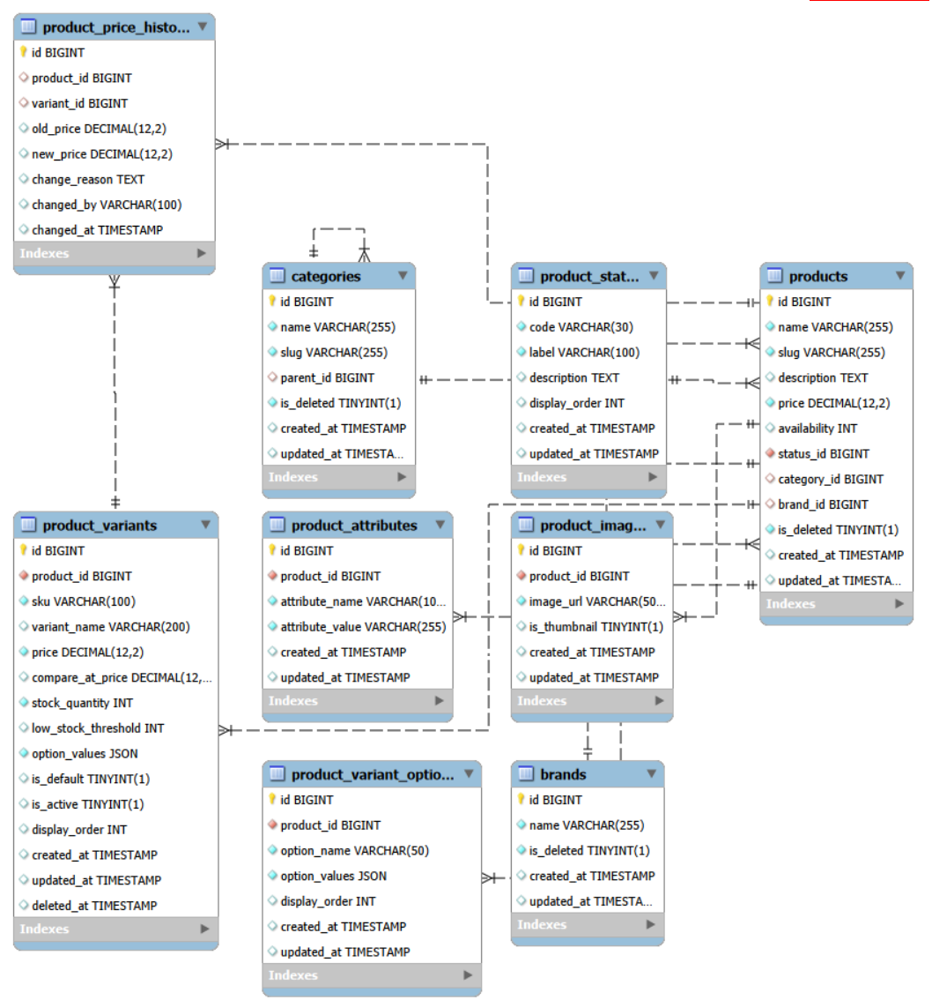
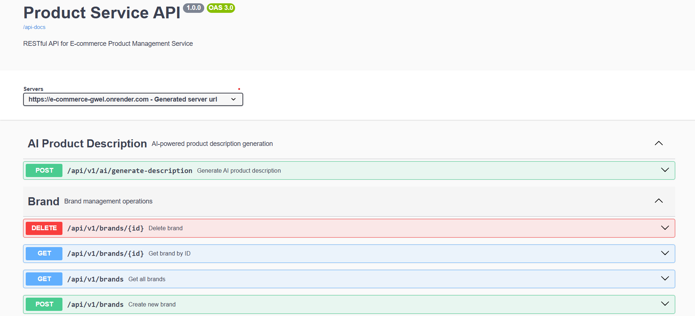

# Product Service
A specialized backend service for managing products in an E-commerce platform with support for product variants, categories, brands, and comprehensive price history tracking.

## Document Organization
- [SYSTEM DESIGN DOCUMENT](#system-design-document)
  - [1. INTRODUCTION](#1-introduction)
    - [1.1 Purpose and Scope](#11-purpose-and-scope)
  - [2. SYSTEM ARCHITECTURE](#2-system-architecture)
    - [2.1 DATABASE DESIGN](#22-database-design)
    - [2.2 Folder Structure](#23-folder-structure)
    - [2.3 Libraries](#24-libraries)
    - [2.4 API Documentation](#25-api-documentation)
    - [2.5 Development](#26-development)
  - [3. How to run](#3-how-to-run)
  - [4. References](#4-references)

## System Design Document
Overview
The System Design Document describes the system requirements, operating environment, system and subsystem architecture, files and database design, input formats, output layouts, API interfaces, detailed design, processing logic, and external interfaces.

### 1. INTRODUCTION
#### 1.1 Purpose and Scope
Product Service is a specialized backend component designed for managing products within an E-commerce ecosystem. Ideally structured to function as a Service-Oriented component, it currently operates as a standalone application.

At this stage, the system relies on the deployed Swagger UI as the primary interface for interaction, verification, and data management, pending the development of a dedicated client application. The service provides comprehensive product management capabilities to support business requirements:

    1. Product catalog management with support for filtering, sorting, and searching 
    products based on different criteria such as name, price, brand, category, and status.
    
    2. All product prices are subject to change at any time and the service maintains 
    a complete history of price changes for audit and reporting purposes.
    
    3. A product always displays the latest price when retrieved through the API.
    
    4. Products can have multiple variants (SKUs) with different combinations of options 
    (e.g., size, color, storage capacity) each with independent pricing and stock levels.
    
    5. Support for hierarchical category structure allowing products to be organized 
    in a tree-like taxonomy with parent-child relationships.
    
    6. Brand management to associate products with their respective manufacturers 
    or brand names.
    
    7. Soft delete functionality to ensure data retention and recovery capability 
    for categories, brands, and products.
    
    8. Multiple image support per product with display ordering capability.
    
    9. Flexible product attributes system using key-value pairs for product 
    specifications and technical details.

### 2. SYSTEM ARCHITECTURE

#### 2.1 Database Design
Product Database Diagram



- products : Product master data with base information
- product_variants : SKU-based variants with individual pricing and stock
- product_variant_options : Variant option definitions (e.g., Color: Red, Size: Large)
- categories : Hierarchical category structure with parent-child relationships
- brands : Brand information with product count tracking
- product_images : Multiple images per product with display ordering
- product_attributes : Flexible key-value attributes for product specifications
- product_price_history : Historical price changes for products and variants
- product_status : Product status codes (Active, Inactive, Draft, etc.)

**Entity Relationship Overview**

The schema is centered on `products` and is designed with normalized 1:N relationships for integrity and maintainability:

- **Classification & Hierarchy**
  - `categories` uses a self-referencing Parent-Child relationship; each category can contain many products.
  - `brands` and `product_status` relate to products via 1:N to support classification and lifecycle state.

- **Variant Architecture**
  - `products` (1) -> (N) `product_variants` to represent multiple SKUs with independent stock and pricing.
  - `product_variants` (1) -> (N) `product_variant_options` to define option combinations (e.g., size, color).

- **Product Extensions & Audit**
  - `products` (1) -> (N) `product_images` and `product_attributes` for media and flexible specifications.
  - `product_price_history` links to `products` and optionally `product_variants` to track all price changes over time.

Key Database Features:
- Soft Delete: is_deleted flag on categories, brands, and products for data retention
- Price History: Automatic tracking of all price changes with timestamps
- JSONB Storage: option_values stored as JSONB for flexible variant combinations
- Constraints: Foreign keys, check constraints, and unique indexes for data integrity
- Timestamps: created_at and updated_at on all major entities

#### 2.2 Folder Structure

For the service, the project follows a layered architecture:
- Controller Layer: REST API endpoints
- Service Layer: Business logic implementation
- Repository Layer: Data access using Spring Data JPA
- Model Layer: JPA entities representing database tables
- DTO Layer: Data transfer objects for request/response
- Mapper Layer: MapStruct mappers for entity-DTO conversion
- Exception Layer: Global exception handling

#### 2.3 Libraries
- spring-boot-starter-web : Web API and RESTful services
- spring-boot-starter-actuator : Monitoring and health management
- spring-boot-starter-data-jpa : Spring Data JPA for database operations
- spring-boot-starter-validation : Jakarta Bean Validation
- spring-boot-starter-security : Authentication and authorization (JWT-based)
- postgresql : PostgreSQL database driver
- flyway-core : Database migration management
- mapstruct : Object mapping code generator
- lombok : Reduce boilerplate code
- springdoc-openapi-starter-webmvc-ui : OpenAPI 3 / Swagger UI documentation
- jjwt (api/impl/jackson) : JWT parsing and validation
- spring-boot-starter-test : Testing components
- spring-boot-devtools : Development environment support

#### 2.4 API Documentation

##### Interactive API Documentation
The service provides interactive API documentation using Swagger UI. In the absence of a complete frontend application, this interface serves as the primary tool for testing, data entry, and exploring the API capabilities on the deployed environment.

**Production URL**: https://e-commerce-gwel.onrender.com/swagger-ui/index.html

**Local Development URL**: http://localhost:8080/swagger-ui.html

Authentication and Authorization
The service uses stateless JWT authentication. Public endpoints are accessible without a token, while write/admin operations require a valid JWT in the `Authorization` header and an `ADMIN` role where enforced.

Swagger UI Authorization
Use the `Authorize` button and provide the token value as: `Bearer <JWT>`.



##### Main API Endpoints

**Brand Management (Public)**
```
GET    /api/v1/brands              - List all brands (paginated, searchable)
GET    /api/v1/brands/{id}         - Get brand by ID
```

**Brand Management (Admin - Requires ADMIN role)**
```
POST   /api/v1/admin/brands        - Create new brand
PUT    /api/v1/admin/brands/{id}   - Update brand
DELETE /api/v1/admin/brands/{id}   - Soft delete brand
```

**Category Management (Public)**
```
GET    /api/v1/categories          - List all categories (paginated, searchable)
GET    /api/v1/categories/{id}     - Get category by ID
```

**Category Management (Admin - Requires ADMIN role)**
```
POST   /api/v1/admin/categories        - Create new category
PUT    /api/v1/admin/categories/{id}   - Update category
DELETE /api/v1/admin/categories/{id}   - Soft delete category
```

**Product Management (Public)**
```
GET    /api/v1/products            - List all products (paginated, searchable)
GET    /api/v1/products/{id}       - Get product by ID
```

**Product Management (Admin - Requires ADMIN role)**
```
POST   /api/v1/admin/products        - Create new product
PUT    /api/v1/admin/products/{id}   - Update product
DELETE /api/v1/admin/products/{id}   - Soft delete product
```

**Product Variant Management**
```
GET    /api/v1/products/{productId}/variants/options      - Get variant options (public)
POST   /api/v1/products/{productId}/variants/options      - Create/update variant options (ADMIN)
DELETE /api/v1/products/{productId}/variants/options      - Delete variant options (ADMIN)
GET    /api/v1/products/{productId}/variants              - List product variants
GET    /api/v1/products/{productId}/variants/{id}         - Get variant by ID
POST   /api/v1/products/{productId}/variants              - Create new variant (ADMIN)
PUT    /api/v1/products/{productId}/variants/{id}         - Update variant (ADMIN)
DELETE /api/v1/products/{productId}/variants/{id}         - Delete variant (ADMIN)
POST   /api/v1/products/{productId}/variants/bulk         - Bulk create variants (ADMIN)
```

**Product Image Management**
```
GET    /api/v1/products/{productId}/images                - List product images
GET    /api/v1/products/{productId}/images/{id}           - Get image by ID
POST   /api/v1/products/{productId}/images                - Upload product image (ADMIN)
POST   /api/v1/products/{productId}/images/multiple       - Upload multiple images (ADMIN)
```

**Price History**
```
GET    /api/v1/products/{productId}/price-history         - Get product price history
GET    /api/v1/variants/{variantId}/price-history         - Get variant price history
```

#### 2.5 Development
- JDK 21
- Spring Boot 4.0.0
- Spring Framework 6.x
- PostgreSQL 16
- Flyway 10.x
- MapStruct 1.5.5.Final
- Docker 24.x
- Maven 3.9+

### 3. How to run

#### Prerequisites
- Install Java 21 or higher
- Install Maven 3.9 or higher
- Install PostgreSQL 16 or higher (or use cloud database like Neon)
- Install Docker (optional, for containerization)

#### Local Development

**1. Clone the repository**
```bash
git clone <repository-url>
cd product-service
```

**2. Configure environment variables**
```bash
# Create .env file from template
cp .env.example .env

# Edit .env with your database configuration
# Example:
DB_URL=jdbc:postgresql://localhost:5432/product_service_db
DB_USERNAME=postgres
DB_PASSWORD=your_password

# JWT configuration (token is issued by an authentication service)
JWT_SECRET=your_jwt_secret
JWT_EXPIRATION=86400000
```

**3. Create database**
```bash
# Using PostgreSQL CLI
createdb product_service_db

# Or using SQL
psql -U postgres
CREATE DATABASE product_service_db;
```

**4. Build the project**
```bash
mvn clean install
```

**5. Running unit tests**
```bash
mvn test
```

**6. Run the application**
```bash
# With Maven
mvn spring-boot:run

# Or with specific profile
mvn spring-boot:run -Dspring-boot.run.profiles=dev

# Or run the JAR file
java -jar target/product-service-0.0.1-SNAPSHOT.jar
```

**7. Access the application**

Once the application has started, you can access:
- Swagger UI: http://localhost:8080/swagger-ui.html
- API Base URL: http://localhost:8080/api/v1
- Health Check: http://localhost:8080/actuator/health
- Database Migrations: Automatic via Flyway on startup

#### Running with Docker

**Build Docker image**
```bash
docker build -t product-service:latest .
```

**Run Docker container**
```bash
docker run -p 8080:8080 \
  -e DB_URL=jdbc:postgresql://host.docker.internal:5432/product_service_db \
  -e DB_USERNAME=postgres \
  -e DB_PASSWORD=postgres \
  -e SPRING_PROFILES_ACTIVE=dev \
  product-service:latest
```

#### Using Docker Compose

**Start all services**
```bash
# Start application and database
docker-compose up -d

# View logs
docker-compose logs -f

# Stop services
docker-compose down
```

### 4. References
[Spring Boot Documentation](https://spring.io/projects/spring-boot)
[Spring Data JPA](https://spring.io/projects/spring-data-jpa)
[Flyway Database Migrations](https://flywaydb.org/)
[MapStruct](https://mapstruct.org/)
[SpringDoc OpenAPI](https://springdoc.org/)
[PostgreSQL Documentation](https://www.postgresql.org/docs/)
[Docker Documentation](https://docs.docker.com/)

